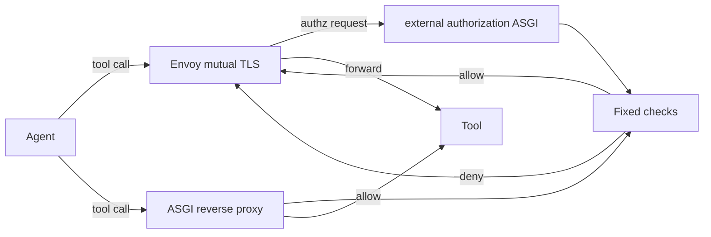
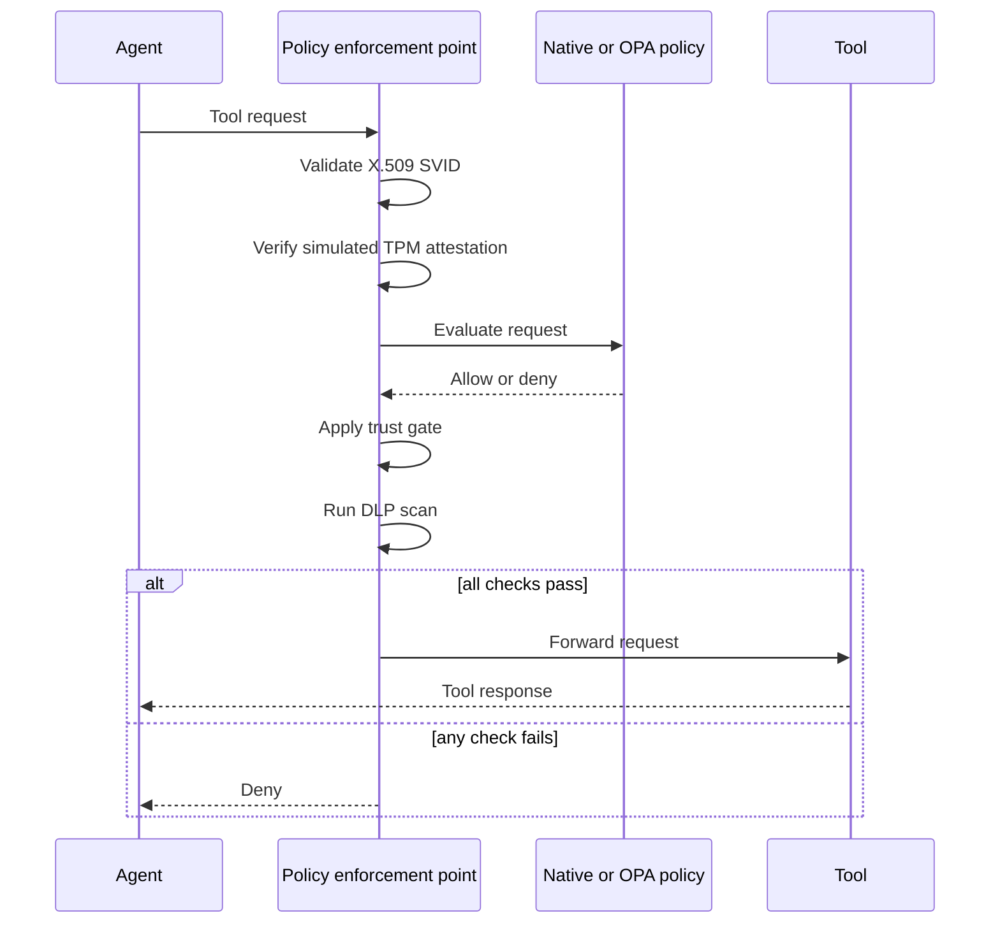

<p align="center"></p>

# Zero Trust AI Agent Proxy

A policy enforcement point (PEP) for AI-agent tool calls that fails closed through X.509 SPIFFE Verifiable Identity Document (SVID) validation, simulated Trusted Platform Module (TPM) attestation, policy, trust, and data loss prevention (DLP) checks.

[](https://github.com/zero-trust-ai-agent-proxy/zero-trust-ai-agent-proxy/actions/workflows/ci.yml)
[](https://github.com/zero-trust-ai-agent-proxy/zero-trust-ai-agent-proxy/actions/workflows/formal.yml)
[](https://github.com/zero-trust-ai-agent-proxy/zero-trust-ai-agent-proxy/actions/workflows/security.yml)
[](https://github.com/zero-trust-ai-agent-proxy/zero-trust-ai-agent-proxy/actions/workflows/codeql.yml)

## Why I built this

I wanted a small, testable enforcement point between an agent and the tools it can call. The proxy treats each tool request as untrusted until identity, device posture, policy, recent behavior, and outbound data checks all pass.

The check order is fixed. A later allow cannot override an earlier deny, and the TLA+ model checks that no allow state exists unless the required predicates still hold.

## How it works

The package exposes two deployment modes. In the Envoy mode, Envoy terminates mutual TLS (mTLS) and calls the Python Envoy external authorization (`ext_authz`) service before forwarding to a tool. In the pure-Python mode, the Asynchronous Server Gateway Interface (ASGI) app acts as the reverse proxy and runs the same decision chain before sending the request upstream.





The attestation check is simulated. It uses signed quote-like data and Platform Configuration Register (PCR) allowlists so I can test the ordering and failure behavior without requiring a physical TPM in continuous integration (CI).

## Quickstart

Linux/macOS:

```bash
python -m venv .venv
. .venv/bin/activate
python -m pip install -e ".[dev]"
python -m uvicorn zero_trust_ai_agent_proxy.asgi:app --host 127.0.0.1 --port 18200
pytest
```

Windows PowerShell:

```powershell
python -m venv .venv
.\.venv\Scripts\Activate.ps1
python -m pip install -e ".[dev]"
python -m uvicorn zero_trust_ai_agent_proxy.asgi:app --host 127.0.0.1 --port 18200
pytest
```

Example decision request:

```bash
curl -s http://127.0.0.1:18200/v1/decide \
  -H 'content-type: application/json' \
  -d '{"agent":{"agent_id":"demo","svid":"valid","attestation":"valid","trust_history":["benign","benign","benign"]},"tool":"http.get","args":{"url":"https://api.acme.test/docs"},"context":{"origin":"user","content":"fetch docs","reasoning_tokens":8},"history":[]}'
```

For the ASGI reverse proxy mode, run `zero_trust_ai_agent_proxy.asgi:proxy_app` and set `AGENT_PROXY_UPSTREAM` to the tool server URL.

Docker-backed Envoy, Open Policy Agent (OPA), and SPIFFE Runtime Environment (SPIRE) checks need Docker. Run them locally with `RUN_INTEGRATION_TESTS=1 pytest -q tests/test_integration.py`, or from the manual Docker integration workflow.

## What I measured

The current benchmark reports are in `results/benchmark-dev` and `results/benchmark-test`. They were produced with the benchmark evaluator API (`zero_trust_agent_benchmark.evaluate.evaluate`) on dataset `zero-trust-agent-benchmark-dataset-v4.1`; the pinned `test.jsonl` sha256 remains `d065bab9bed145490579cd7add6a574c6e23c21c0ea4525dc1c14b0fc15acd2b`.

| Claim | Result | Outcome | Plain reading |
|---|---:|---|---|
| Benchmark v4 attacks blocked with issued secrets | 100.0% [99.2, 100.0] | Met | All 500 attack traces were blocked. |
| Benchmark v4 false-positive rate with issued secrets | 1.8% [0.9, 3.4] | Met on point estimate | 9 of 500 benign traces were blocked; the Wilson interval is reported honestly. |
| Benchmark v4 leaks with issued secrets | 0 leaks; 0.0% [0.0, 0.4] | Met | No trace leaked a benchmark secret. |
| Benchmark v4 without issued secrets | 100.0% block, 1.8% false positives, 0 leaks | Met | Structural detectors covered this test split even without vault-issued secret values. |
| P95 benchmark decision latency | 0.722 ms [0.639, 0.816] | Met | Benchmark adapter overhead is under 1 ms p95 in this local run. |
| Throughput >= 1,100 requests per second per instance | Previous committed run peaked at 950 requests per second at 8 workers and c32; one-worker criterion was 151 requests per second | Not met | Throughput was not remeasured for this defense-only change and remains a gap. |

### Benchmark ablation on the test split

| Version | Change | Block rate | False-positive rate | Leak rate | P95 latency |
|---|---|---:|---:|---:|---:|
| Version 1 | Committed baseline | 98.6% [97.1, 99.3] | 39.4% [35.2, 43.7] | 0.0% [0.0, 0.4] | 0.170 ms [0.161, 0.177] |
| Improvement 1 | Issued-secret and structural secret detection replaces broad high-entropy blocking | Dev split reduced false positives from 39.6% to 4.0% while preserving 100% issued-secret leak blocking | Dev-only | Dev-only | Dev-only |
| Improvement 2 | Intent-aware high-risk action gating and bounded database maintenance | Dev split reached 100% block rate with 2.0% false positives | Dev-only | Dev-only | Dev-only |
| Final | Combined controls; official test evaluator | 100.0% [99.2, 100.0] | 1.8% [0.9, 3.4] | 0.0% [0.0, 0.4] | 0.722 ms [0.639, 0.816] |

The final row is the only post-change test-split design iteration used for the committed result. Intermediate rows are marked dev-only to avoid tuning on test failures.

## Limitations

- The TPM path is a simulator. It is useful for exercising fail-closed ordering, but it is not a hardware quote verifier.
- The policy layer supports native Python rules and OPA calls, but policy distribution and signing are out of scope here.
- The DLP scanner is recursive and decoding-aware, but the benchmark v4 result shows that it is too aggressive on benign traces.
- The TLA+ model checks the no-bypass property for a bounded state space. It does not model every parser or network failure.
- Envoy `ext_authz` is the supported Envoy integration. Python is not loaded as an Envoy WASM filter.

## License

Apache-2.0. Cite this software using `CITATION.cff`.
